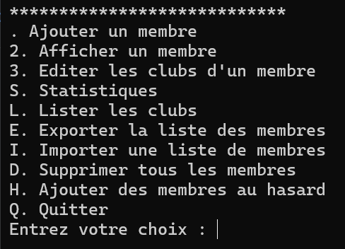

# Social Club Management

This C++ program allows efficient management of social club members.

## Features

- **Add a Member**: Easily add new members to the club.
- **View a Member**: Display the details of a specific member.
- **Edit a Member's Clubs**: Modify the clubs associated with a member.
- **Statistics**: Obtain statistics about members and clubs.
- **List Clubs**: Display the complete list of available clubs.
- **Export Member List**: Export member information to a file for external use.
- **Import Member List**: Import a list of members from a file.
- **Delete All Members**: Remove all members from the database.
- **Add Random Members**: Automatically add randomly generated members for testing.
- **Quit**: Safely exit the program.

## Screenshot

---

